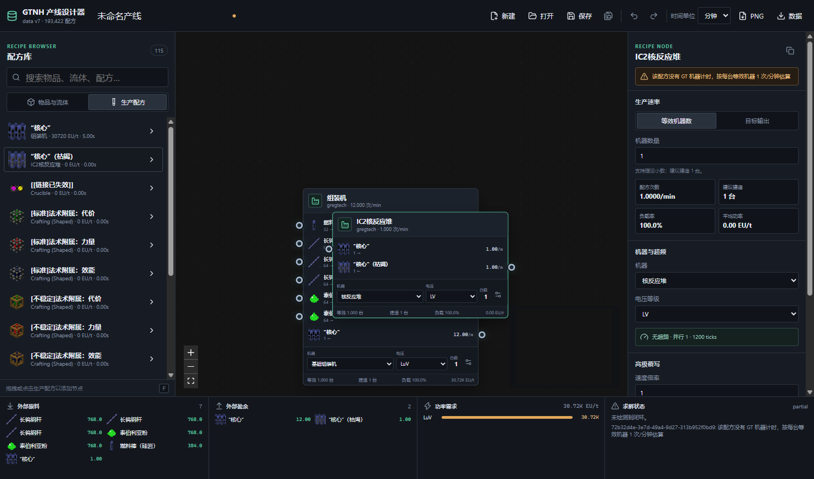
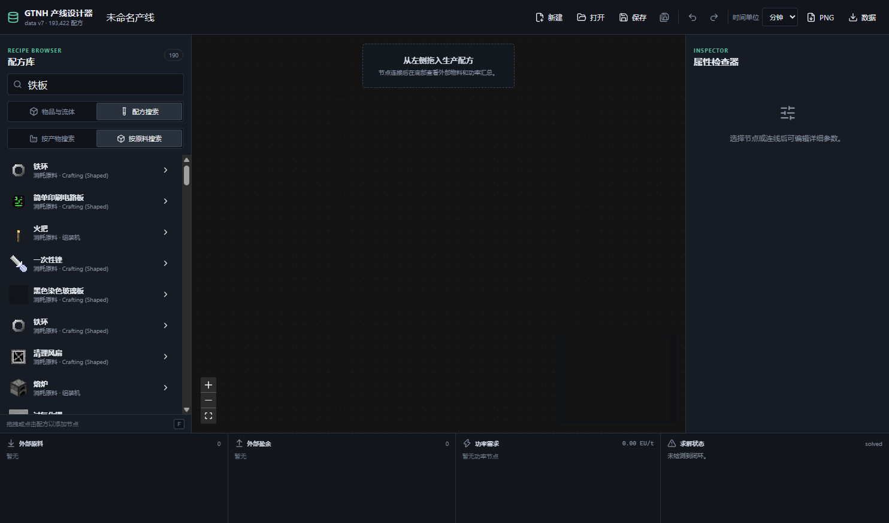
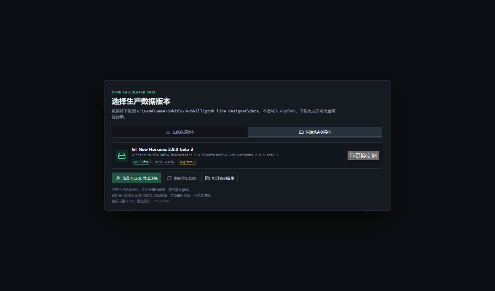

# GTNH Line Designer

面向 GregTech: New Horizons 的本地可视化产线设计器。应用使用 Electron、React 和 TypeScript 构建，将 GTNH 配方显示为可连接的节点，并提供物料平衡、机器数量、超频和功率分析。

> 当前 Release 不包含 `data.bin.gz`、`atlas.webp` 或任何 GTNH 配方数据包。数据由用户在线下载，或从本机 GTNH 实例通过 NESQL 导入。



## 主要功能

- 类似 Shader Graph 的节点编辑器，每个配方节点显示真实输入、输出、图标、数量和概率。
- 手动建立节点拓扑，不自动展开依赖树。
- 点击“计算”后才执行求解，避免编辑过程中持续占用 CPU。
- 支持物品、流体、矿辞、容器流体和机器专属配方变换。
- 配方搜索区分“按产物搜索”和“按原料搜索”，不会自动合并配方变体。
- 支持普通超频、完美超频、EBF 线圈、融合机层级、并行上限和高级倍率覆写。
- 支持机器数量模式、目标输出模式、扇入扇出、边优先级和回收环。
- 底部分析栏汇总外部原料、外部盈余、各电压等级功率和求解警告。
- 支持撤销重做、复制粘贴、框选、缩放、MiniMap、自动保存和崩溃恢复。
- 项目保存为 `.gtnhgraph` JSON，可导出 PNG 产线图。



## 数据来源

应用支持两种数据获取方式。

### 在线数据

首次启动可从 `ShadowTheAge/gtnh-data` 选择并下载 data v7 数据。下载支持超时、重试、Range 续传和镜像回退。

### 本机 NESQL 导入

数据管理器可以绑定本机 GTNH 实例：

- GTNH 2.9.x 使用内置 NESQL Exporter `0.5.7-ShadowTheAge`。
- GTNH 2.8.4 使用独立构建的 NESQL Exporter `0.5.6-ShadowTheAge`。

应用会事务性移走冲突的 BugTorch，并安装对应的 NESQL 版本。游戏仍由用户手动启动，用户需要进入世界、打开 NEI 物品列表并执行界面给出的 `/nesql` 命令。导出完成后，应用调用内置转换器生成本地 data v7 缓存。



详细来源、固定提交和许可证说明见 [docs/DATA_SOURCES.md](docs/DATA_SOURCES.md)。

## 下载与运行

GitHub Releases 提供 Windows x64 免安装便携包。解压到任意可写目录后运行 `GTNH Line Designer.exe`。

核心数据、项目、设置和日志默认保存在程序目录，不把配方数据写入 `%APPDATA%`。建议不要放在需要管理员权限的 `Program Files` 下。

## 基本使用

1. 启动应用并选择在线数据版本，或绑定本机 GTNH 实例。
2. 从左侧配方库搜索产物或原料。
3. 将配方拖入画布。
4. 从输出端口拖动到另一个节点的输入端口。
5. 在右侧检查器配置电压、线圈、超频、并行数和节点速率。
6. 点击顶部“计算”。
7. 查看底部的外部物料、功率和循环警告。
8. 保存 `.gtnhgraph` 项目或导出 PNG。

使用本机导入时，应用不会启动游戏，也不会操作世界、存档或玩家数据。

## 开发

环境要求：

- Node.js 22 或更新版本
- npm
- Windows x64

```powershell
npm install
npm run dev
```

类型检查、测试和构建：

```powershell
npm run typecheck
npm test
npm run build
```

第三方集成包含 NESQL Exporter 和 data v7 转换器，不提交到 Git 仓库。首次构建便携包前执行：

```powershell
npm run integrations:build
```

该命令按照 [scripts/build-integrations.mjs](scripts/build-integrations.mjs) 中固定的提交重新构建资源，然后生成便携包：

```powershell
npm run package
```

## 数据与发布说明

- 本仓库和 Release 不包含 GTNH 配方数据包。
- NESQL 导出内容受上游 exporter plugin 范围限制。
- 本机导出数据只适用于对应的整合包版本、模组集合和配置。
- 用户添加额外模组后，应重新执行 NESQL 导入。
- `data.bin` 和 `atlas.webp` 包含 Minecraft、GTNH 及多个模组派生的名称、文本和图标，公开再分发前需要取得相应许可。

## 文档

- [架构说明](docs/ARCHITECTURE.md)
- [数据与第三方来源](docs/DATA_SOURCES.md)
- [变更日志](CHANGELOG.md)
- [第三方声明](THIRD_PARTY_NOTICES.md)

## 许可证

项目源码使用 [MIT License](LICENSE)。第三方组件和数据来源适用各自许可证。
